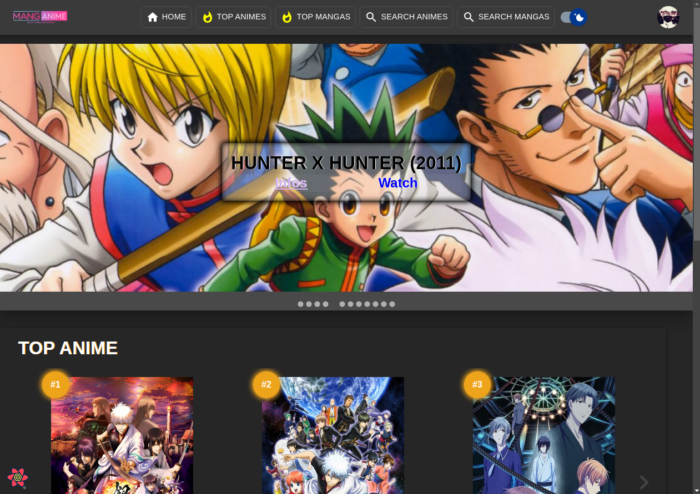

# Projet React Mastery - MangAnime

---

# To see this project in action locally :

- git clone git@github.com:Tadkozh/manganime.git
- Remember to create your .env.local from the .env template
- npm install
- npm start
- enjoy !

**API :**

- Jikan API (REST)
- AniList Api (GraphQL)

**The tools used :**

- Notion
- Figma
- Trello
- Git / Github
- VSCode
- Chat GPT
- npm

**Libraries :**

- Style JS :

  - prettier

- Style CSS :

  - Material UI

- Backend :

  - Firebase (Authentication + Firestore Database + Storage)

- React :

  - axios
  - react-router-dom
  - react-error-boundary
  - react-query
  - React Hook Form
  - React-material-ui-carousel

- Tests :
  - msw
  - faker
  - Jest
  - Cypress
  - user-event
  - React Testing Library
