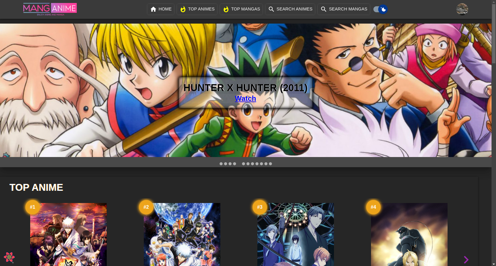
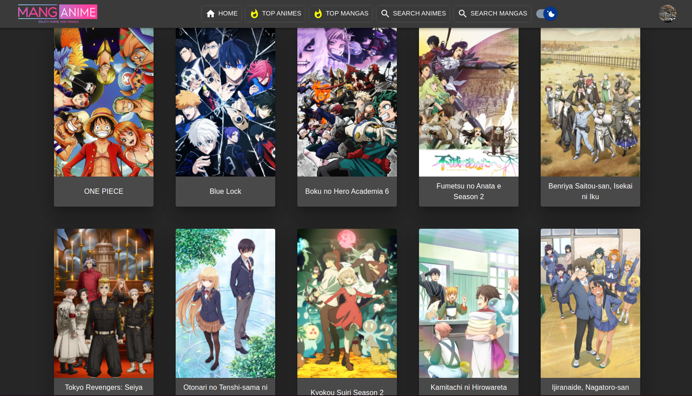
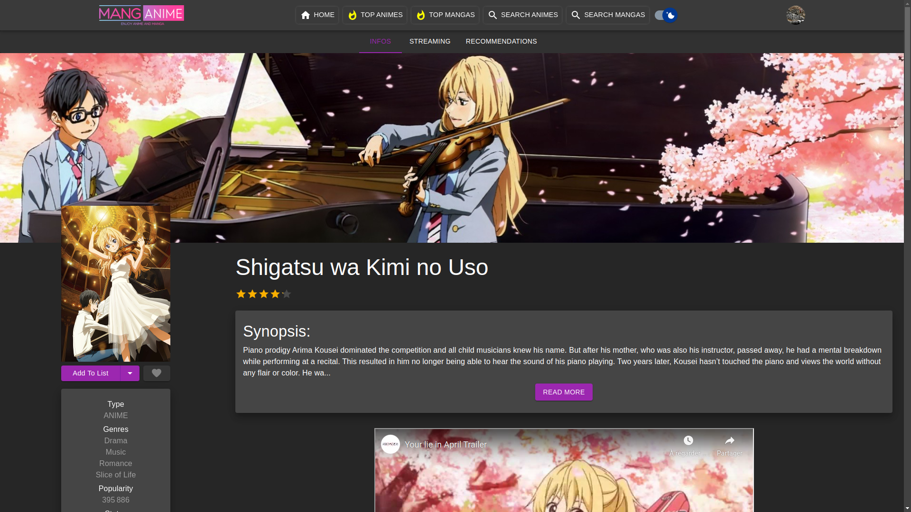
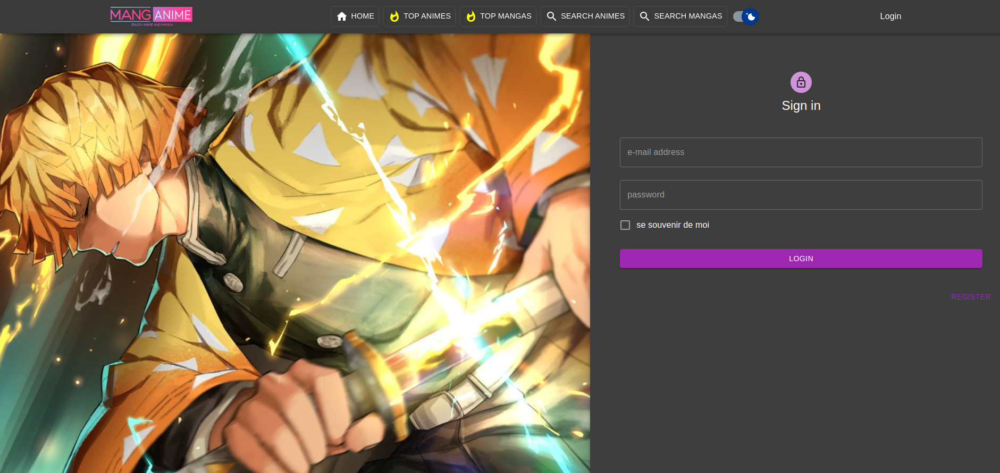
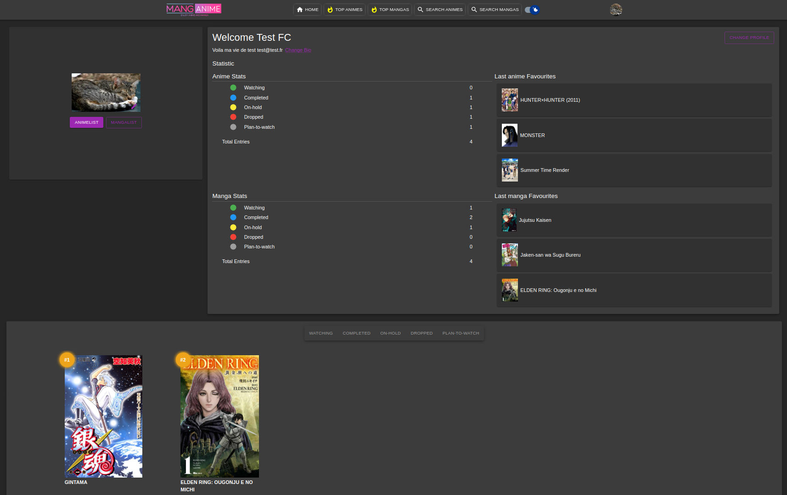

# Projet React Mastery - MangAnime

The aim of this project is to apply our knowledge on React and work in Team, using Git and Scrum agile method.

A few required elements :

**Technical elements :**

- Repo Github
- Continuous deployment
- Testing
- Always UP

**Stack/Code :**

- Hooks
- Context API (or State Manager)
- Components library
- Login/Register
- API call

We choose React application from scratch with [create-react-app](https://create-react-app.dev/)

**API :**

- [Jikan API (REST)](https://docs.api.jikan.moe/)
- [AniList Api](https://anilist.co/) [(GraphQL)](https://anilist.co/graphiql)

---

# To see this project in action locally :

- git clone git@github.com:Tadkozh/manganime.git
- Create a Firebase project with 'Authentication', 'Firestore' and 'Storage' and replace the project id in firebaserc
- Also remember to create your .env.local from the .env template (datas are in your Firebase project, see project settings)
- npm install
- npm start
- Enjoy !

You can also see the projet online : [Netlify](https://manganimerm.netlify.app/)

# Technologies

**The tools used :**

- Discord
- Notion
- Figma
- Google Drive
- Trello
- Git / Github
- VSCode
- Chat GPT
- npm

**Libraries :**

- Style JS :

  - prettier

- Style CSS :

  - Material UI

- Backend :

  - Firebase (Authentication + Firestore Database + Storage)

- React :

  - axios
  - react-router-dom
  - react-error-boundary
  - react-query
  - React Hook Form
  - React-material-ui-carousel

- Tests :
  - msw
  - faker
  - Jest
  - Cypress
  - user-event
  - React Testing Library

Take a look to [Resources](https://github.com/Tadkozh/manganime/tree/dev/ressources) : User stories, Wireframe
